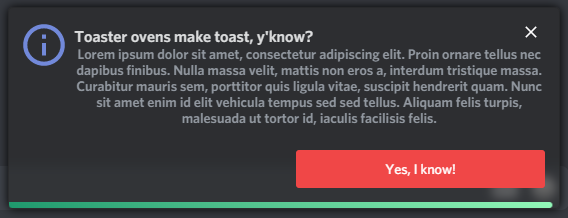

# Better Toasts
Makes Powercord's default toasts a bit spicier. 


# Installation & Updating
For installation, go to **Themes -> Open a CMD / Powershell / Terminal / Gitbash** in the folder, and enter the following:
```
git clone https://github.com/LuckFire/Better-Toasts
```

Since Powercord's updater is currently broken, you have to update the theme manually. In order to do this, go to **Themes -> Better-Toasts -> Open a CMD / Powershell / Terminal / Gitbash** in the folder, and enter the following:
```
git pull
```

# More Previews


